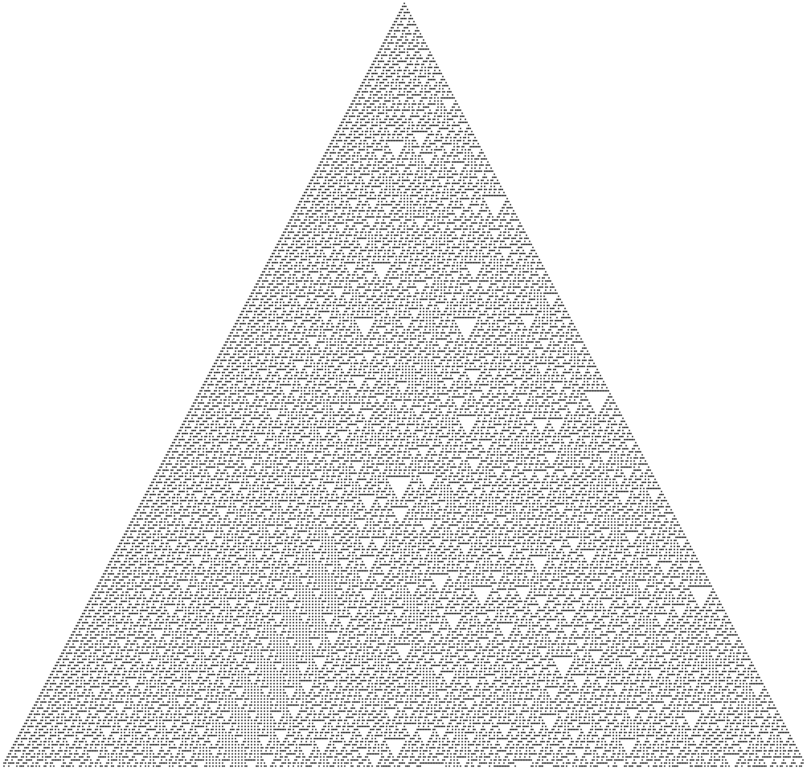

# Elementary CA generator for terminal

(https://crates.io/crates/ca-term)


This is a cli tool that can show all elementary Cellular Automata on a text based terminal. More details about elementary cellular automata here: https://mathworld.wolfram.com/ElementaryCellularAutomaton.html.



It displays the CA on the terminal with whatever character you pass in ascii or unicode. If you pass a unicode character just one unicode code point is allowed.


Help from the command itself is, I think, self-explanatory:

```
ca-term 0.0.1
Author: est357
Description: Cellular automata for terminal

USAGE:
    ca-term [OPTIONS]

FLAGS:
    -h, --help       Prints help information
    -V, --version    Prints version information

OPTIONS:
    -c, --character <display_character>
            The character with which it will be drawn. Just 1 character. [default: ◼]

    -g, --generations <generations>                  How many lines it should generate. Number value. [default: 100]
    -b, --init_bit <initial_bit>
            Initial bit 1 position. Between 0 and width value. Number value. [default: 100]

    -i, --interval <interval_between_generations>
            Time interval in us to wait bewtween generations. Number value. [default: 200000]

    -r, --rule <rule>
            The CA rule number according to https://mathworld.wolfram.com/ElementaryCellularAutomaton.html. Number
            value. [default: 30]
    -w, --width <width>                              Width of the screen.Number value < 256. [default: 200]


```

If you want you can generate a image like this:
```
ca-term -g 250 -b 250 -w 500 | pango-view --font=mono -qo rule30_gen1.png /dev/stdin
```


Can also be used as a seed for sha256 private key from which a crypto currency address (like ETH,BTC) can be generated.
